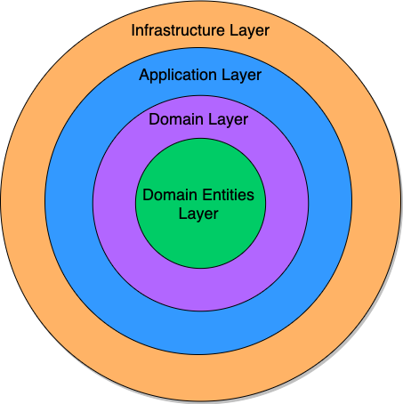

# The Onion Architecture
## Introduction
This document proposes a structuring for code for a system of services based on the onion architecture. For context,

- this form utilizes lessons from domain driven design
- the problem domain is warehouse management
- with consideration of Thor's technical stack

## Architectural Diagram
The diagram below shows the general layout of the onion architecture. Persistence layer, application layer, domain layer and domain entities layer are located from outer circle to inner circle.

The following diagram shows the inside of each layer and the dependency between each layer.

&nbsp;
## The Dependency Rule
As shown in the above diagram, outer layers may depend on inner layers, but inner layers can never depend on outer layers. The kind of dependency directionality emphasized by onion architecture is **source code dependency**, not run-time dependency. If layer A calls functions, implements interfaces, or references types in layer B, then layer A is considered to be depending on layer B in this context.

&nbsp;
## Architectural Components
### Domain Entities Layer
It contains core business entities and value objects of the domain model, e.g.: pick ticket, purchase order, SKU, etc. Those entities must be plain data structures using the native F# record type. Classes that expose behaviors should not be domain entities.

### Domain Layer
It contains fundamental business rules that are not likely to change easily. In Thor, event sourcing is the default technique used for state management of domain entities. Thus the domain service is responsible for the full event sourcing cycle of each domain entity, including loading events, folding events for an aggregate, processing commands for an aggregate to generate new events, and persisting new events. It is notable that a domain service doesn't directly call a persistence layer for loading or persisting events, but it invokes methods exposed in persistence interface.

### Application Layer
It contains high level use cases, which are typically written in product stories. For example, "When receiving a package shipping label generated message, find divert assignment for it and send the divert assignment to downstream. " is a use case, a product story. To complete this use case, the application service consumes the message and calls the domain service for finding divert assignment and sends the message to downstream. It also invokes methods in persistence interface. In our code, application layer frequently reside in controllers or consumers.

Application layer generally doesn't manage the persistence of domain entities, but it handles the message communication.

Sometimes, there are business rules that are of higher level than domain layer and lower level than use cases. In this case, we should extract the sub-domain out of it.

### Persistence Interface
Persistence interface exposes the methods that domain or application layer needs from persistence layer. Although it bridges application/domain service and persistence layer, it is part of domain layer or application layer, so the methods should be of the same level of abstraction as domain or application service. The interface may reference domain entities, but not any types specific to persistence layer.

### Persistence Layer
The persistence service implements persistence interface by interacting with data store or external systems, so it depends on application or domain layer through interface implementation and depends on domain entities layer through type referencing.

&nbsp;
## Principles
### Dependency Inversion
The application and domain layers have run-time dependency on the persistence layer, while the persistence layer has source code dependency on the application and domain layers. Therefore, inversion of control takes place here, which is key in an onion architecture. In such, there is a clean separation between business logic (application, domain and domain entities layers) and infrastructure (persistence layer). Here are the benefits:

- The code in application and domain layers is not populated with persistence specific details, such as connection strings, Kafka parameters, etc.
- The shared project of bounded context domain does not depend on any infrastructure libraries (like Equinox, FsKafka, Marvel Eventstore, etc, which are generally not stable) and thus become much more stable.
- Any changes in persistence logic don't demand changes in application or domain layers. For example, if we need to insert the same data in multiple DB clusters during a DB migration, only the persistence layer needs to change. This makes the system flexible to change.

### Dependency Injection
The dependency injection separates the concern of service instantiation from service definition. All the application, domain and persistence service objects are created and can only be created during program initiation at entry point (either Program.fs or Startup.fs). Singleton services can easily be instantiated at Program.fs, and scoped services (commonly needed in API controllers) have to be configured at Startup.fs by using IServiceCollection.